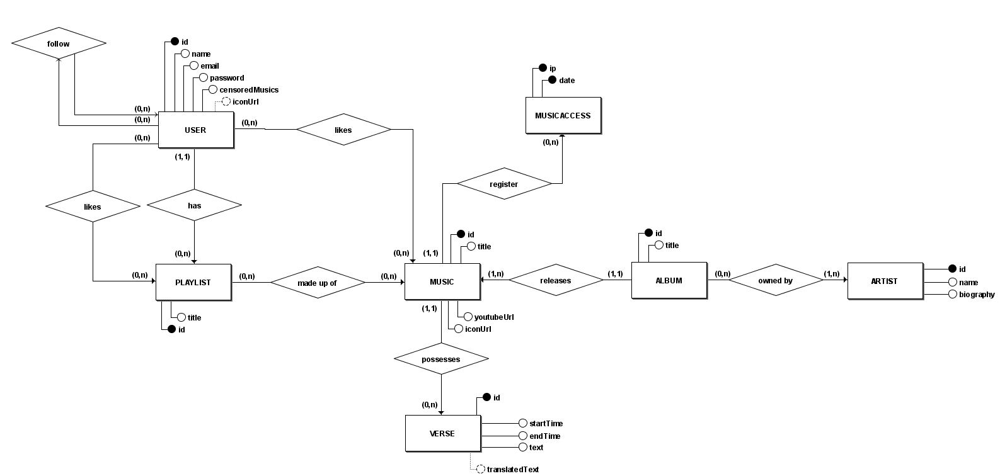
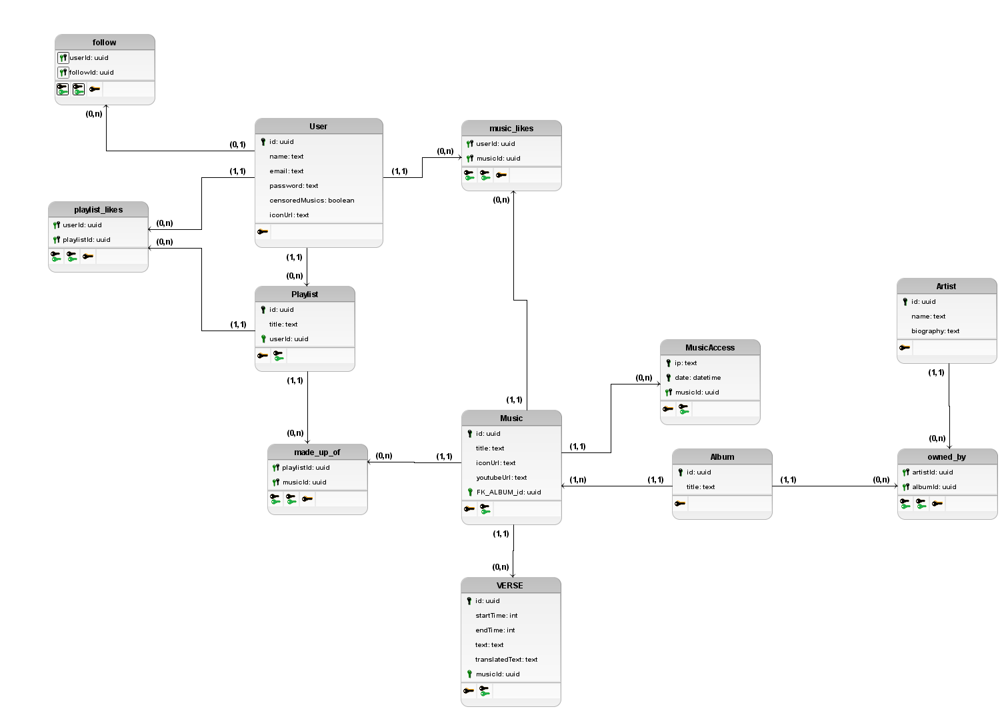

# 4.1. Módulo Estilos e Padrões Arquiteturais

## Versionamento

| Descrição                           | Autor                                                                   | Data       |
| ----------------------------------- | ----------------------------------------------------------------------- | ---------- |
| Backlog UC                          | Todos, exceto Vinicius, Rafael e Gustavo Henrique                       | 22/07/2024 |
| DE-R                                | Cauã, Bruno, Leonardo, Gustavo Kenzo, Gustavo Henrique, Manoel e Rafael | 30/07/2024 |
| DLD                                 | Cauã, Maria e Samuel                                                    | 07/08/2024 |
| Diagrama de Pacotes                 | Cauã, Gustavo Kenzo                                                     | 10/08/2024 |
| Adição do diagrama de Casos de uso  | Leonardo Lago, Gustavo Kenzo                                            | 14/08/2024 |
| revisão do diagrama de Casos de uso | Gustavo Henrique, Cauã                                                  | 14/08/2024 |

## 1. Introdução

[A introdução do Documento de Arquitetura de Software fornece uma visão geral de todo o Documento de Arquitetura de Software. Inclui o propósito, escopo, definições, acrônimos, abreviações, referências e uma visão geral do Documento de Arquitetura de Software.]

### 1.1 Propósito

[Esta seção define o papel ou propósito do Documento de Arquitetura de Software, na documentação geral do projeto, e descreve brevemente a estrutura do documento. O público-alvo específico do documento é identificado, com uma indicação de como se espera que eles utilizem o documento.]

### 1.2 Escopo

[Uma breve descrição do que o Documento de Arquitetura de Software abrange; o que é afetado ou influenciado por este documento.]

### 1.3 Definições, Acrônimos e Abreviações

[Esta subseção fornece as definições de todos os termos, acrônimos e abreviações necessárias para interpretar corretamente o Documento de Arquitetura de Software. Esta informação pode ser fornecida por referência ao Glossário do projeto.]

### 1.4 Referências

[Esta subseção fornece uma lista completa de todos os documentos referenciados em outras partes do Documento de Arquitetura de Software. Identifique cada documento pelo título, número do relatório (se aplicável), data e organização de publicação. Especifique as fontes de onde as referências podem ser obtidas. Esta informação pode ser fornecida por referência a um apêndice ou a outro documento.]

### 1.5 Visão Geral

[Esta subseção descreve o que o restante do Documento de Arquitetura de Software contém e explica como o Documento de Arquitetura de Software está organizado.]

## 2. Representação Arquitetônica

[Esta seção descreve o que é a arquitetura de software para o sistema atual e como ela é representada. Das Visões de Caso de Uso, Lógica, Processo, Implementação e Implantação, ela enumera as visões que são necessárias e, para cada visão, explica quais tipos de elementos de modelo ela contém.]

## 3. Objetivos e restrições arquiteturais

[Esta seção descreve os requisitos e objetivos de software que têm um impacto significativo na arquitetura; por exemplo, segurança, privacidade, uso de um produto pronto, portabilidade, distribuição e reutilização. Também captura as restrições especiais que podem se aplicar: estratégia de design e implementação, ferramentas de desenvolvimento, estrutura da equipe, cronograma, código legado e assim por diante.]

## 4. Visão de Caso de Uso

| Código | Descrição do Caso de Uso            |
| ------ | ----------------------------------- |
| UC01   | Cadastrar usuário                   |
| UC02   | Autenticar usuário                  |
| UC03   | Atualizar usuário                   |
| UC04   | Atualizar preferência de palavrões  |
| UC05   | Deletar Conta de usuário            |
| UC06   | Buscar Música                       |
| UC07   | Cadastrar Música                    |
| UC08   | Traduzir Música                     |
| UC09   | Favoritar Música                    |
| UC10   | Recomendar Música                   |
| UC11   | Listar as 5 melhores músicas do dia |
| UC12   | Buscar Cantores                     |
| UC13   | Ver perfil                          |
| UC14   | Favoritar Cantores                  |
| UC15   | Criar Playlist                      |
| UC16   | Buscar Playlist                     |
| UC17   | Favoritar Playlist                  |
| UC18   | Deletar Playlist                    |
| UC19   | Seguir Pessoas                      |
| UC20   | Buscar Parte da Letra               |
| UC21   | Reportar Erros                      |

<!-- [Esta seção lista casos de uso ou cenários do modelo de caso de uso se eles representarem alguma funcionalidade significativa e central do sistema final, ou se tiverem uma ampla cobertura arquitetônica — exercem muitos elementos arquitetônicos ou se destacam ou ilustram um ponto específico e delicado da arquitetura.] -->

### 4.1 Diagrama de Caso de Uso

<figure align="center">

  <figcaption>Digrama de Caso de Uso - My_Lyric</figcaption>
</figure>

## 5 Visão Lógica

[Esta seção descreve as partes arquitetonicamente significativas do modelo de design, como sua decomposição em subsistemas e pacotes. E para cada pacote significativo, sua decomposição em classes e utilitários de classe. Você deve apresentar classes arquitetonicamente significativas e descrever suas responsabilidades, bem como alguns relacionamentos, operações e atributos muito importantes.]

### 5.1 Visão Geral

[Esta subseção descreve a decomposição geral do modelo de design em termos de sua hierarquia de pacotes e camadas.]

### 5.2 Pacotes de Design arquiteturalmente significantes

[Para cada pacote significativo, inclua uma subseção com seu nome, uma breve descrição e um diagrama com todas as classes e pacotes significativos contidos dentro do pacote. Para cada classe significativa no pacote, inclua seu nome, breve descrição e, opcionalmente, uma descrição de algumas de suas principais responsabilidades, operações e atributos.]

#### 5.2.1 Diagrama de Pacotes

<figure align="center">

  <figcaption>Digrama de Pacotes - My_Lyric</figcaption>
</figure>

O diagrama de pacotes é uma representação gráfica que organiza os elementos de um sistema em agrupamentos lógicos chamados pacotes. Esse diagrama é usado para mostrar a organização hierárquica dos pacotes e as dependências entre eles, facilitando a visualização da estrutura modular do sistema e a gestão da complexidade do projeto. É uma ferramenta crucial para entender e manter a arquitetura do sistema, permitindo que as equipes de desenvolvimento identifiquem facilmente como os diferentes módulos se interconectam e colaboram.

## 6. Visão de Processo

[Esta seção descreve a decomposição do sistema em processos leves (threads únicos de controle) e processos pesados (agrupamentos de processos leves). Organize a seção por grupos de processos que se comunicam ou interagem. Descreva os principais modos de comunicação entre os processos, como passagem de mensagens, interrupções e rendezvous.]

## 7. Visão de Implantação

[Esta seção descreve uma ou mais configurações de rede física (hardware) nas quais o software é implantado e executado. É uma visão do Modelo de Implantação. No mínimo, para cada configuração, deve-se indicar os nós físicos (computadores, CPUs) que executam o software e suas interconexões (barramento, LAN, ponto a ponto, e assim por diante). Também inclua um mapeamento dos processos da Visão de Processo nos nós físicos.]

## 8. Visão de Implementação

[Esta seção descreve a estrutura geral do modelo de implementação, a decomposição do software em camadas e subsistemas no modelo de implementação e quaisquer componentes arquitetonicamente significativos.]

### 8.1 Visão Geral

[Esta subseção nomeia e define as várias camadas e seus conteúdos, as regras que regem a inclusão em uma determinada camada e os limites entre as camadas. Inclua um diagrama de componentes que mostre as relações entre as camadas.]

### 8.2 Camadas

[Para cada camada, inclua uma subseção com seu nome, uma enumeração dos subsistemas localizados na camada e um diagrama de componentes.]

## 9. Visão de Dados

<!-- [Uma descrição da perspectiva de armazenamento de dados persistentes do sistema. Esta seção é opcional se houver poucos ou nenhum dado persistente, ou se a tradução entre o Modelo de Design e o Modelo de Dados for trivial.] -->

### DE-R

### DLD

## 10. Tamanho e Desempenho

[Uma descrição das principais características dimensionais do software que impactam a arquitetura, bem como as restrições de desempenho alvo.]

## 11. Qualidade

[Uma descrição de como a arquitetura de software contribui para todas as capacidades (além da funcionalidade) do sistema: extensibilidade, confiabilidade, portabilidade, e assim por diante. Se essas características tiverem um significado especial, como implicações de segurança, privacidade ou segurança, elas devem ser claramente delineadas.]

## Foco_01: Arquitetura de Software

Entrega Mínina: Especificação de 2 Visões do DAS (ESCOPO: necessariamente a Lógica, e mais uma (Processo; Implementação; Implantação ou Dados)).

OBS: A Visão de Caso de Uso, por ser uma visão já conhecida por vocês em outras disciplinas, não faz parte do escopo. Mas, pode ser explorada caso queiram.

Apresentação (em sala) explicando o Documento de Arquitetura (DAS), com: (i) rastro claro aos membros participantes (MOSTRAR QUADRO DE PARTICIPAÇÕES & COMMITS); (ii) justificativas & senso crítico sobre esse artefato, em especial detalhando particularidades sobre estilos e padrões arquiteturais idealizados para a aplicação; (iii) breve apresentação das visões do DAS no escopo da aplicação, e (iv) comentários gerais sobre o trabalho em equipe. Tempo da Apresentação: +/- 8min. Recomendação: Apresentar diretamente via Wiki ou GitPages do Projeto. Baixar os conteúdos com antecedência, evitando problemas de internet no momento de exposição nas Dinâmicas de Avaliação.

A Wiki ou GitPages do Projeto deve conter um tópico dedicado ao Módulo Estilos e Padrões Arquiteturais, com Especificação das Visões do DAS, histórico de versões, referências, e demais detalhamentos gerados pela equipe nesse escopo.

Demais orientações disponíveis nas Diretrizes (vide Moodle).
