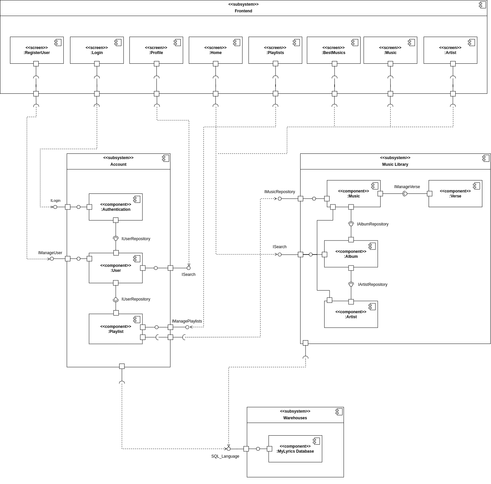

# 2.2.1. Notação UML – Diagramas Estáticos

### Foco_1: Modelagem UML Estática

Diagramação estática é uma técnica de engenharia de software que mostra a estrutura de um sistema. Esses diagramas exibem os componentes do sistema, seus atributos, métodos e como eles se relacionam. Sua principal função é oferecer uma visão clara e detalhada da arquitetura do sistema, o que facilita a compreensão, a comunicação entre equipes e a manutenção do software. É essencial na fase de design e documentação do sistema.

#### Diagrama de classes

Diagrama de classes é uma representação gráfica da estrutura e relações entre as classes de um sistema. Ele mostra as classes e interfaces do sistema, seus atributos, métodos e as relações entre elas. É uma ferramenta essencial para a modelagem de sistemas orientados a objetos, pois ajuda a visualizar a estrutura do sistema e a identificar possíveis problemas de design.

<figure align="center">

  <figcaption>Digrama de Classes - My_Lyric</figcaption>
</figure>

#### Diagrama de pacotes

O diagrama de pacotes é uma representação gráfica que organiza os elementos de um sistema em agrupamentos lógicos chamados pacotes. Cada pacote contém elementos relacionados, como classes, interfaces e outros pacotes. Esse diagrama é usado para mostrar a organização hierárquica dos pacotes e as dependências entre eles, facilitando a visualização da estrutura modular do sistema e a gestão da complexidade do projeto. É uma ferramenta crucial para entender e manter a arquitetura do sistema, permitindo que as equipes de desenvolvimento identifiquem facilmente como os diferentes módulos se interconectam e colaboram.

<figure align="center">

  <figcaption>Digrama de Pacotes - My_Lyric</figcaption>
</figure>

#### Diagrama de componentes

Para entendermos como os componentes principais da aplicação iriam se comunicar e
juntos formarem a solução do produto, foi elaborado um diagrama de componentes:

<figure align="center">

  <figcaption>Digrama de Componentes - My_Lyric</figcaption>
</figure>

#### Diagrama de implantação

O Diagrama de Implantação é essencial para visualizar a configuração física do hardware e a distribuição dos componentes de software em um sistema. Ele mostra como o software é implantado na infraestrutura de hardware, incluindo servidores, dispositivos ou nodos. O objetivo é garantir que o hardware esteja dimensionado adequadamente para atender às demandas do software e proporcionar uma compreensão clara de como os diferentes módulos do sistema interagem entre si através da rede.

<figure align="center">

  <figcaption>Digrama de Componentes - My_Lyric</figcaption>
</figure>

# Referências

- [Serrano, Milene](https://arquivos.unb.br/arquivos/2024160122eee73064516ee6c9dc85853/Arquitetura_e_Desenho_de_Software_-_Aula_Modelagem_UML_Esttica_-_Profa._Milene.pdf)
- [UML Diagrams](https://www.uml-diagrams.org/)

# Histórico de versão

| Descrição                          | Autor                                           | Data       |
| ---------------------------------- | ----------------------------------------------- | ---------- |
| Diagrama de Componentes            | Cauã, Maria e Lucas                             | 07/07/2024 |
| Diagrama de Estados                | Cauã e Maria                                    | 07/07/2024 |
| Diagrama de Classes                | Gustavo Henrique, Leonardo e Vinicius           | 07/07/2024 |
| Diagrama de Implantação            | Julio, Rafael e Samuel                          | 08/07/2024 |
| Recriação do diagrama de classe    | Gustavo Kenzo, Ian, Leonardo, Manoel e Vinicius | 08/07/2024 |
| Diagrama de Pacotes                | Bruno, Gustavo Kenzo e Manoel                   | 08/07/2024 |
| Adicionando histórico de versão    | Cauã                                            | 22/07/2024 |
| Adicionando referências            | Cauã                                            | 25/07/2024 |
| Atualização do diagrama de pacotes | Cauã, Gustavo Kenzo                             | 10/08/2024 |
| Atualização do diagrama de classes | Bruno, Leonardo                                 | 12/08/2024 |
