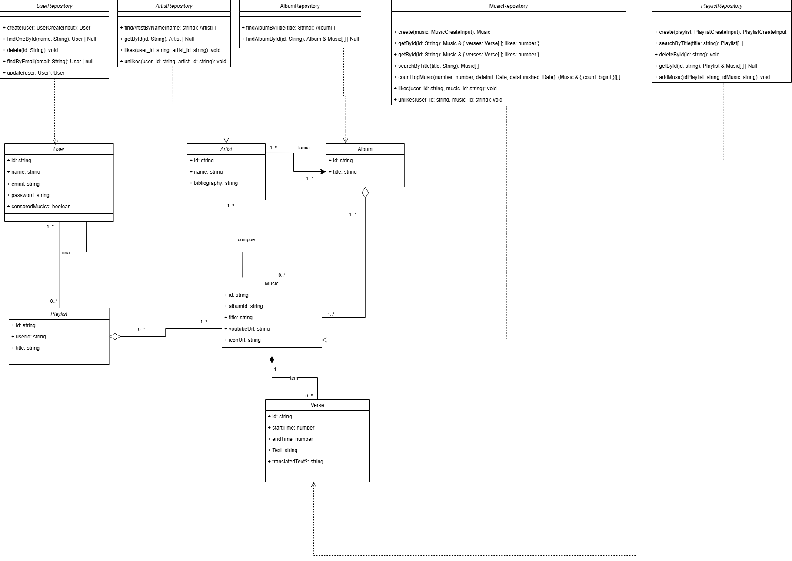

# 2.2.1. Notação UML – Diagramas Estáticos

### Foco_1: Modelagem UML Estática
Diagramação estática é uma técnica de engenharia de software que mostra a estrutura de um sistema. Esses diagramas exibem os componentes do sistema, seus atributos, métodos e como eles se relacionam. Sua principal função é oferecer uma visão clara e detalhada da arquitetura do sistema, o que facilita a compreensão, a comunicação entre equipes e a manutenção do software. É essencial na fase de design e documentação do sistema.

#### Diagrama de classes
Diagrama de classes é uma representação gráfica da estrutura e relações entre as classes de um sistema. Ele mostra as classes e interfaces do sistema, seus atributos, métodos e as relações entre elas. É uma ferramenta essencial para a modelagem de sistemas orientados a objetos, pois ajuda a visualizar a estrutura do sistema e a identificar possíveis problemas de design.

<figure align="center">

  
  <figcaption>Digrama de Classes - My_Lyric</figcaption>
</figure>

#### Diagrama de pacotes

#### Diagrama de componentes
Para entendermos como os componentes principais da aplicação iriam se comunicar e
juntos formarem a solução do produto, foi elaborado um diagrama de componentes:

<figure align="center">

  
  <figcaption>Digrama de Componentes - My_Lyric</figcaption>
</figure>

#### Diagrama de implantação
O Diagrama de Implantação é essencial para visualizar a configuração física do hardware e a distribuição dos componentes de software em um sistema. Ele mostra como o software é implantado na infraestrutura de hardware, incluindo servidores, dispositivos ou nodos. O objetivo é garantir que o hardware esteja dimensionado adequadamente para atender às demandas do software e proporcionar uma compreensão clara de como os diferentes módulos do sistema interagem entre si através da rede.

<figure align="center">

  
  <figcaption>Digrama de Componentes - My_Lyric</figcaption>
</figure>

