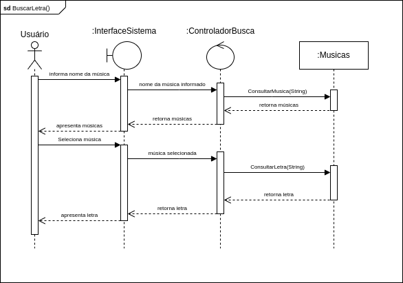
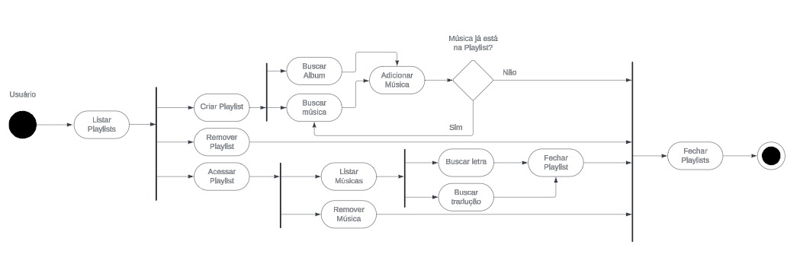
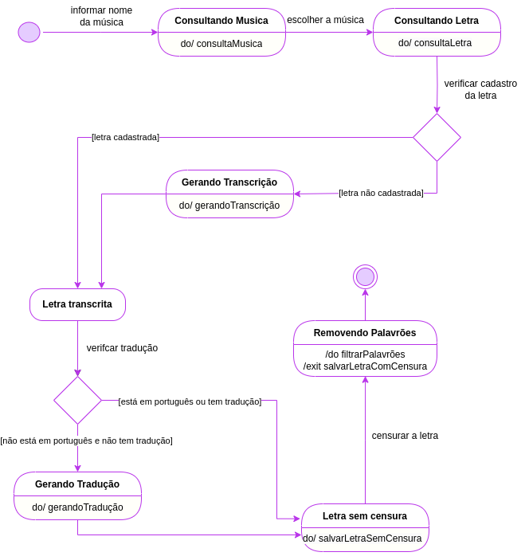
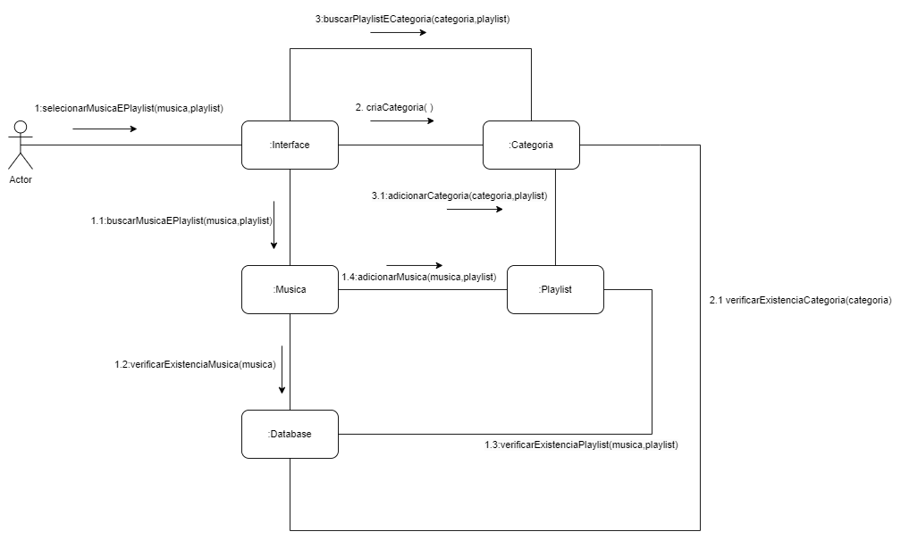

# 2.1.2. Notação UML – Diagramas Dinâmicos

### Foco_2: Modelagem UML Dinâmica

Modelagem dinâmica é a criação de diagramas que modelam o comportamento e a interação dos componentes de um sistema ao longo do tempo. Essenciais na engenharia de software, esses diagramas ajudam a visualizar e entender a lógica de funcionamento, a interação entre componentes e a evolução dos estados do sistema. Utilizados principalmente nas fases de análise e design, eles garantem que todas as partes interessadas compreendam o funcionamento do sistema. Os principais tipos de diagramas dinâmicos são: Diagrama de Sequência, Diagrama de Atividades, Diagrama de Estados e Diagrama de Comunicação/Colaboração.

#### Diagrama de Sequência

O Diagrama de Sequência ilustra a interação entre os objetos de um sistema em uma ordem temporal específica. Ele descreve como e em que ordem os objetos funcionam. Isso é particularmente útil para entender o fluxo de operações em cenários complexos e para identificar possíveis gargalos ou ineficiências.

<figure align="center">

  <figcaption>Digrama de Atividades - My_Lyric</figcaption>
</figure>

#### Diagrama de Atividade

Além do diagrama de sequência, também elaboramos um diagrama de atividades, que mostra a sequência de atividades que ocorrem no sistema. Esse diagrama é útil para entender como as atividades são executadas e quais são as etapas necessárias para concluir uma atividade.

<figure align="center">

  <figcaption>Digrama de Atividades - My_Lyric</figcaption>
</figure>

#### Diagrama de Estados
Para entendermos como os estadoS principais de nossa aplicação interagem e se transformam ao longo do tempo, foi elaborado um diagrama de estados. Este diagrama fornece uma visão clara e detalhada das transições de estado e eventos que ocorrem na aplicação:

<figure align="center">

  
  <figcaption>Digrama de Estados - My_Lyric</figcaption>
</figure>

#### Diagrama de Comuncação/Colaboração
Para entender como os componentes da nossa aplicação interagem, foi elaborado um diagrama de comunicação. Este diagrama mostra claramente as mensagens trocadas entre os objetos e as funções que eles desempenham. Ele destaca o fluxo de informações e a sequência de interações, ajudando a visualizar como os componentes colaboram para alcançar os objetivos da aplicação.

<figure align="center">

  
  <figcaption>Digrama de Comunicação - My_Lyric</figcaption>
</figure>

