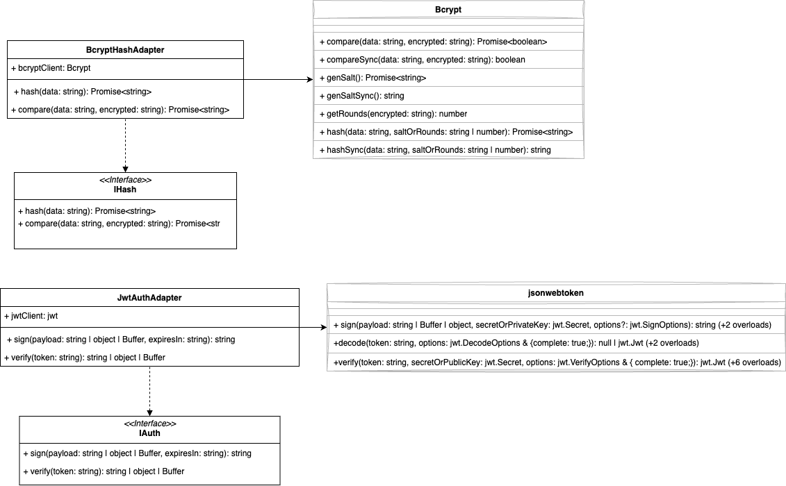
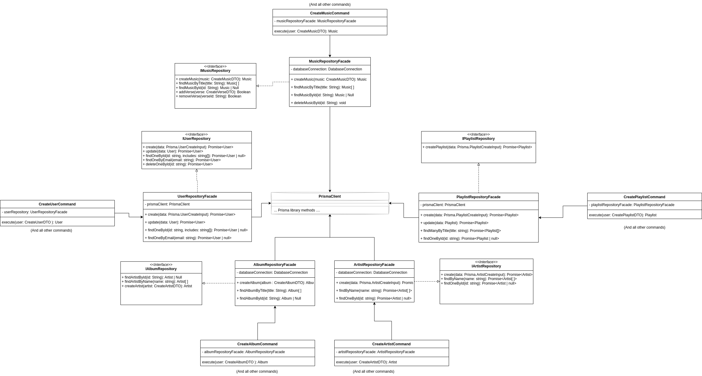

# 3.2. Módulo Padrões de Projeto GoFs Estruturais

Os padrões estruturais são um dos três tipos principais de padrões de design de software (junto com os padrões criacionais e comportamentais). Eles se concentram na composição de classes e objetos para formar estruturas maiores, simplificando a criação de novos sistemas complexos. Exemplos incluem o padrão Adapter, que permite que classes com interfaces incompatíveis trabalhem juntas, e o padrão Facade, que fornece uma interface simplificada para um conjunto de interfaces em um subsistema complexo. Esses padrões ajudam a garantir que o sistema seja modular, reutilizável e fácil de manter.

## Adapters

Os adapters são utilizados quando você tem um objeto que já existe com uma interface própria dele, mas você precisa que ele funcione com outra interface.  
Esse padrão de projeto permite exatamente isso, você adaptar um objeto à uma
interface de sua escolha.

Para nosso projeto, adaptamos algumas bibliotecas para uma interface nossa.
Dessa forma, garantimos que se no futuro nós precisarmos mudar a biblioteca ou
api para busca, basta criar um novo adapter e utilizar ele em toda a
aplicação sem precisar refatorar muitas coisas. Também evidenciamos com a cor cinza as bibliotecas que foram usadas para fazer o adapter.

<figure align="center">

  <figcaption>Libs Adapter - My_Lyric</figcaption>
</figure>

## Facades

Já os facades servem para criar uma nova interface para simplificar um subsistema,
biblioteca, framework ou junção de várias classes.

No nosso caso, utilizamos as Facades para simplificar as interações com o banco
de dados. Criamos interfaces simplificadas que resolvem sub-problemas com o banco.

Utilizar uma facade ao invés de diretamente o ORM ou SQL puro garante que caso
seja necessário alterar o banco de dados, não ficaremos acoplados a ele. Basta
criar uma facade específica para o novo banco e todo o sistema continuará
funcionando perfeitamente.

<figure align="center">

  <figcaption>Repositories Facades - My_Lyric</figcaption>
</figure>

# Diferenças

As principais diferenças entre Facade e Adapters é que o adapter apenas adapta
um objeto à uma nova interface. Já o Facade, cria uma nova interface para
simplificar outros objetos.

# Referências

- [Serrano, Milene](https://arquivos.unb.br/arquivos/202415314643a230798133defe04b5d97/Arquitetura_e_Desenho_de_Software_-_Aula_GoFs_Estruturais_-_Profa._Milene.pdf)
- [Refactoring Guru](https://refactoring.guru/pt-br/design-patterns/structural-patterns)
- [Fireship](https://youtu.be/tv-_1er1mWI?si=9QQtWoqDZMSPgbMH)
- [Geekific, Adapter](https://www.youtube.com/watch?v=wA3keqCeKtM&list=PLlsmxlJgn1HJpa28yHzkBmUY-Ty71ZUGc&index=17)
- [Geekific, Facade](https://www.youtube.com/watch?v=xWk6jvqyhAQ&list=PLlsmxlJgn1HJpa28yHzkBmUY-Ty71ZUGc&index=21)

# Histórico de versão

| Descrição                                | Autor                                                         | Data       |
| ---------------------------------------- | ------------------------------------------------------------- | ---------- |
| Adicionando histórico de versão          | Cauã                                                          | 22/07/2024 |
| Adicionando adapters                     | Vinicius, Bruno, Gustavo Henrique, Cauã, Maria, Gustavo Kenzo | 22/07/2024 |
| Adicionando facades                      | Manoel, Leonardo, Samuel, Lucas, Rafael, Julio, Ian           | 22/07/2024 |
| Adicionando referências                  | Cauã                                                          | 25/07/2024 |
| Adicionando explicações                  | Cauã                                                          | 25/07/2024 |
| Adicionando os participantes das Facades | Cauã                                                          | 01/08/2024 |
| Refatoração dos Adapters                 | Cauã, Gustavo Kenzo                                           | 10/08/2024 |
