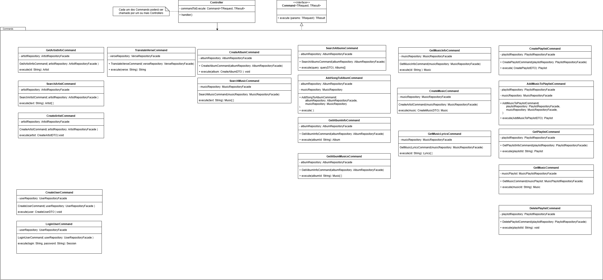

# 3.3. Módulo Padrões de Projeto GoFs Comportamentais

Os padrões comportamentais são um dos três tipos principais de padrões de design de software, ao lado dos padrões criacionais e estruturais. Eles se concentram em como as classes e objetos interagem e se comunicam, definindo algoritmos e fluxos de controle de forma dinâmica. Um exemplo é o padrão State, que permite que um objeto altere seu comportamento quando seu estado interno muda, tornando o objeto parecer que muda de classe. Outro exemplo é o padrão Command, que encapsula uma solicitação como um objeto, permitindo parametrizar clientes com filas, solicitações e operações. Esses padrões ajudam a tornar o sistema mais flexível, permitindo fácil extensão e manutenção.

## State Pattern

<figure align="center">

  <figcaption>Pattern State</figcaption>
</figure>

## Command Pattern

<figure align="center">

  <figcaption>Pattern Command</figcaption>
</figure>

# Histórico de versão

| Descrição                                                               | Autor                                         | Data       |
| ----------------------------------------------------------------------- | --------------------------------------------- | ---------- |
| Adicionando histórico de versão                                         | Cauã                                          | 22/07/2024 |
| Adicionando imagem do Pattern State                                     | Cauã, Manoel, Samuel e Vinicius               | 25/07/2024 |
| Adicionando imagem do Pattern Command                                   | Leonardo, Lucas e Ian                         | 25/07/2024 |
| Adicionando descrição dos padrões comportamentais de design de software | Lucas, Gustavo Kenzo, Gustavo Henrique, Bruno | 25/07/2024 |
